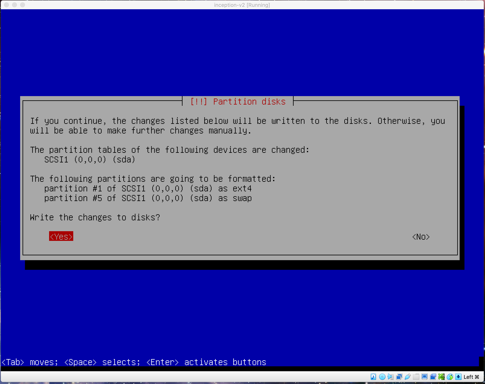
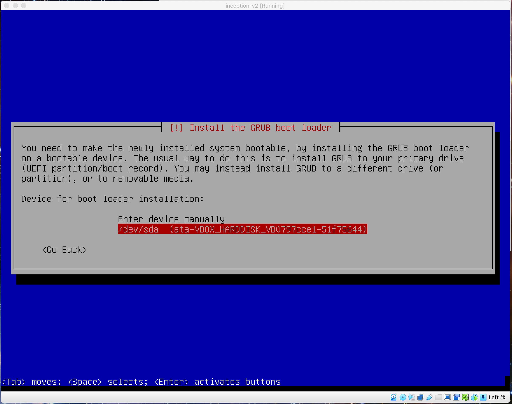
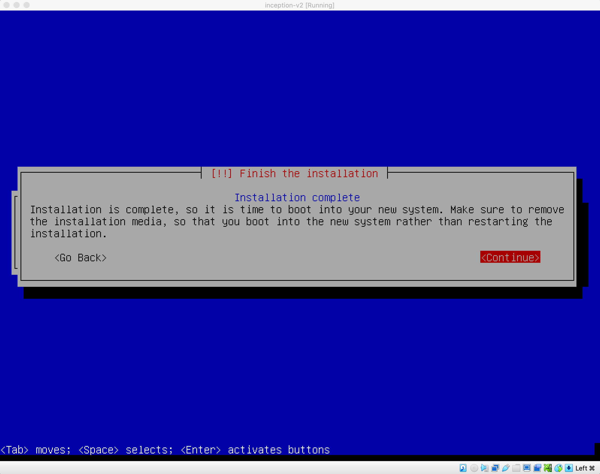

# inceptionVm-guide
## This is a guide to install the virtual machine for Inception project for 42 School

first of all start by adding the virtual machine to your virtualbox by clicking new


next write the name of the vm and don't select the iso as it will do thing automatically for this version of virtualbox. after this step just go with default settings and click create


when you start the virtual machine you will be asked to select the iso file to install the vm. select the iso file and click start you can install the debian iso from the debian website [here](https://cdimage.debian.org/debian-cd/current/amd64/iso-cd/debian-11.6.0-amd64-netinst.iso)


go for the manual installer and select the default settings and click continue


until you reach the user creation step. here you can create a user with the name of your choice and a password. you can put your intra log in as the username. after this step you can click continue and the installation will start.


choose guided - use entire disk and click enter


go for all files in one partition and click continue


just click continue and the installation will start


click yes and the installation will start



when it ask for the media installation click continue and then you will get this option click yes


and then select no


select what suits you and click enter


continue with the default settings and click continue


default enter


the only things you would need are ssh server and standard system utilities. click continue


now install the GRUB boot loader


select the disk you want to install the GRUB boot loader on and click continue

which is in our case /dev/sda



now your vm is installed and you can start it and login with the user you created



write the username and password


switch to root user with the following command:

```bash
su -
```


update and upgrade the system
and then install sudo with the following command:

```bash
apt-get update && apt-get upgrade && apt-get install sudo -y
```


add your user to the sudo group with the following command:

```bash
adduser username sudo
```

or

```bash
 usermod -aG sudo username
```


now you can edit the sudoers file with the following command:
```bash
sudo visudo
```


just edit the line below the root line adding yuor username and the privileges you want to give it. in our case we will give it all privileges


for the ssh you can edit the /etc/ssh/sshd_config file and change the port to 4242


find the line with Port 22 and change it to Port 4242


change it to 4242


restart the ssh service with the following command:

```bash
sudo service ssh restart
```


now if you want to display it in vs code you can install the remote ssh extension


click the little icon on the bottom left


click on connect current window to host if you want the same window


choose + Add New SSH Host...


write your username and localhost followed by the port ex:

```bash
aalseri@localhost -p 4242
```


click continue


go for the first config file


you can see that it's successfully connected when you see the pop up on the bottom right corner of the screen


write the password of the user and you will be connected to the vm


once the SSH:localhost appear on the bottom left corner of the screen you can just navigate to the folder you want to work on same as you do with your own computer


installation you need to make before going forward:
```bash
sudo apt-get install git wget zsh vim docker docker-compose make openbox xinit kitty firefox-esr
```

Install curl to be able to install the latest version of docker-compose

```bash
sudo apt install curl
```

Installing the latest version of docker-compose

```bash
sudo curl -L "https://github.com/docker/compose/releases/latest/download/docker-compose-$(uname -s)-$(uname -m)" -o /usr/local/bin/docker-compose
```

```bash
sudo chmod +x /usr/local/bin/docker-compose
```

to be able to access the websites or filezilla you just need to execute:

```bash
startx
```


you can click on web browser and you will be able to access the website


to be able to access your website via username.42.fr you need to edit the /etc/hosts file and add the following line:

```bash
vim /etc/hosts
```


add new line under your host name

127.0.0.1   username.42.fr


### NOTE: Keep in mind this is a guide to help coders do the project efficiently and faster by providing the minimum things they would need to complete it and not install many useless things such as gui which would make the virtual machine slow and crash at some point.

## License  
[MIT](https://choosealicense.com/licenses/mit/)  
